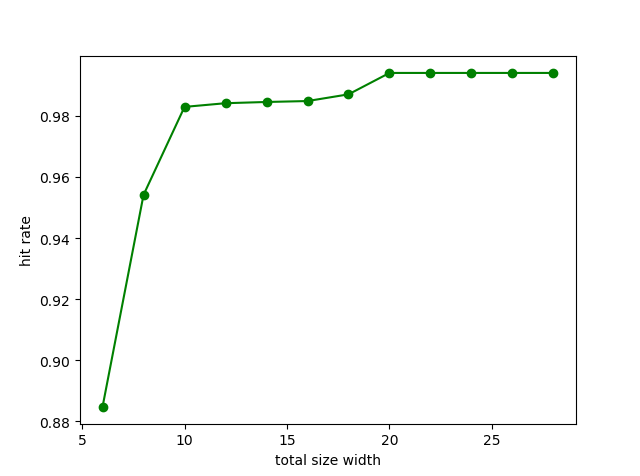
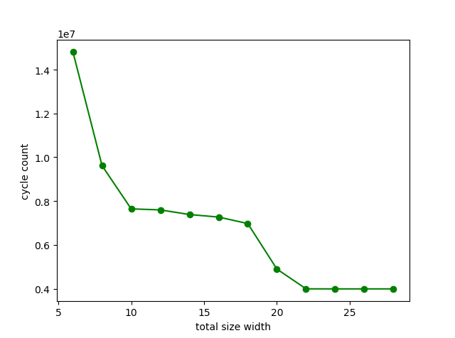
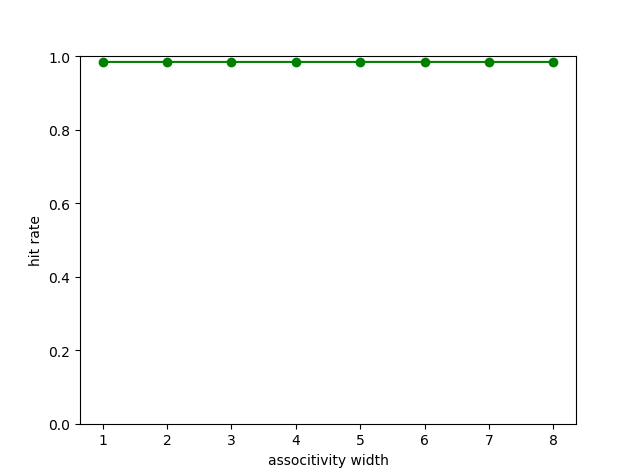
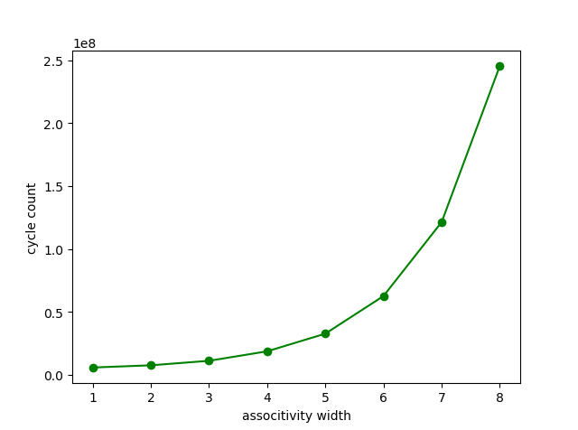
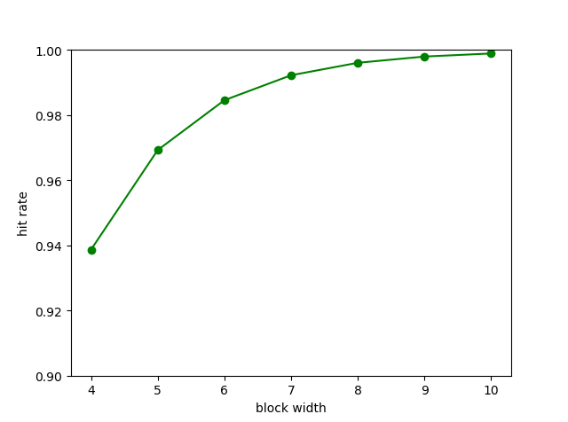
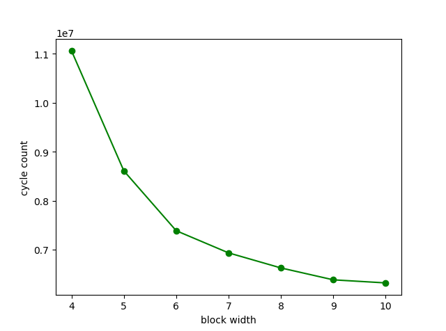

# LAB4_REPORT

### cache实现：

首先我在common.h中定义了一些宏:

```C
#define totalSizeWidth 14
#define assoWidth 2

#define CACHE_SIZE (1<<totalSizeWidth)  //cache的大小
#define CACHE_ASSO (1<<assoWidth)     //cache的关联度
#define cache_groupnum_bit (totalSizeWidth-assoWidth-BLOCK_WIDTH)  //cache组数的位串长度
#define cache_group_num exp2(cache_groupnum_bit)  //cache组数
#define cache_line_num CACHE_ASSO  //cache行数

#define mem_blockaddr_bit BLOCK_WIDTH //块内地址的位串长度
```

因此在测试不同参数时，在更改main函数init_cache参数的同时这里也需要同步更改 totalSizeWidth 和 assoWidth 。
在cache.c中，我使用了一个结构体来表示cache行,并用一个静态数组cache来模拟cache：

```C
typedef struct
{
  bool valid;   //有效位
  bool dirty;   //脏位
  uint64_t tag;  //标记
  uint64_t mem_block_num; //主存块号
  uint8_t data[BLOCK_SIZE];
}cache_line;
cache_line cache[cache_group_num][cache_line_num];
```
init_cache的实现十分简单，仅需初始化cache即可：
```C
void init_cache(int total_size_width, int associativity_width) {
  for(int i=0;i<total_size_width-BLOCK_SIZE-associativity_width;i++){
    for(int j=0;j<(1<<associativity_width);j++){
      cache[i][j].valid=0;
      cache[i][j].dirty=0;
      cache[i][i].tag=0;
      cache[i][j].mem_block_num=0;
      memset(cache[i][j].data,0,sizeof(cache[i][i].data));
    }
  }
}
```
同时，注意到块内地址需要按四字节对齐，故在read和write时都将addr置为addr&~0x3。
cache_read代码如下：

```C
uint32_t cache_read(uintptr_t addr) {
  addr&=~0x3;
  int group_num=(addr&((1<<(cache_groupnum_bit+mem_blockaddr_bit))-1))>>mem_blockaddr_bit;
  for(int i=0;i<cache_line_num;i++){
    cycle_increase(1);
    if(cache[group_num][i].valid==1 && cache[group_num][i].tag==(addr>>(mem_blockaddr_bit+cache_groupnum_bit))){
      hit++;
      uint32_t *res=(void*)(cache[group_num][i].data+((addr %BLOCK_SIZE)));
      return *res;
    }
  }
  //未命中
  miss++;
  for(int i=0;i<cache_line_num;i++){
    cycle_increase(1);
    if(cache[group_num][i].valid==0){
      mem_read(addr>>mem_blockaddr_bit,cache[group_num][i].data); //从主存读取主存块号
      cache[group_num][i].valid=1;
      cache[group_num][i].tag=addr>>(mem_blockaddr_bit+cache_groupnum_bit);
      cache[group_num][i].mem_block_num=addr>>mem_blockaddr_bit;
      uint32_t* res=(void*)(cache[group_num][i].data+((addr%BLOCK_SIZE)));
      return *res;
    }
  }
  //没有空闲行，随机替换
  int line=rand()%cache_line_num;
  cycle_increase(1);
  mem_write(cache[group_num][line].mem_block_num,cache[group_num][line].data);
  mem_read(addr>>mem_blockaddr_bit,cache[group_num][line].data);
  cache[group_num][line].valid = 1;
	cache[group_num][line].dirty = 0;
	cache[group_num][line].tag = addr >> (mem_blockaddr_bit+cache_groupnum_bit);
	cache[group_num][line].mem_block_num = addr >> mem_blockaddr_bit;
  uint32_t* res=(void*)(cache[group_num][line].data+((addr %BLOCK_SIZE)));
  return *res;
}
```
cache_write也与cache_read相似，代码如下：
```C
void cache_write(uintptr_t addr, uint32_t data, uint32_t wmask) {
  int group_num=(addr&((1<<(cache_groupnum_bit+mem_blockaddr_bit))-1))>>mem_blockaddr_bit;
  addr&=~0x3;
  for(int i=0;i<cache_line_num;i++){
    cycle_increase(1);
    if(cache[group_num][i].valid==1 && cache[group_num][i].tag==(addr>>(mem_blockaddr_bit+cache_groupnum_bit))){
      hit++;
      //直接写cache
      uint32_t *res = (void *)(cache[group_num][i].data + ((addr%BLOCK_SIZE)));
			*res = (*res & ~wmask) | (data & wmask);
      cache[group_num][i].dirty = 1;
      return;
    }
  }
  //未命中
  miss++;
  for(int i=0;i<cache_line_num;i++){
    cycle_increase(1);
    if(cache[group_num][i].valid==0){
      //先从主存中读出来，修改后再写回
      mem_read(addr>>mem_blockaddr_bit,cache[group_num][i].data);
      uint32_t *res=(void*)(cache[group_num][i].data+((addr%BLOCK_SIZE)));
      *res=(*res&~wmask)|(data&wmask);        
      cache[group_num][i].dirty=0;
      cache[group_num][i].valid=1;
      cache[group_num][i].tag=addr>>(mem_blockaddr_bit+cache_groupnum_bit);
      cache[group_num][i].mem_block_num = addr >> mem_blockaddr_bit;
      mem_write(addr>>mem_blockaddr_bit,cache[group_num][i].data);
      return;
    }
  }
  //无空闲行，随机替换
  int line=rand()%cache_line_num;
  cycle_increase(1);
  //脏位为1，则需回写主存
  if(cache[group_num][line].dirty==1){
    mem_write(cache[group_num][line].mem_block_num,cache[group_num][line].data);
  }
  mem_read(addr>>mem_blockaddr_bit,cache[group_num][line].data);
  uint32_t *res=(void*)(cache[group_num][line].data+((addr %BLOCK_SIZE)));
  *res=(*res&~wmask)|(data&wmask);
  cache[group_num][line].valid = 1;
	cache[group_num][line].dirty = 0;
	cache[group_num][line].tag = addr >> (mem_blockaddr_bit+cache_groupnum_bit);
	cache[group_num][line].mem_block_num = addr >> mem_blockaddr_bit;
  mem_write(addr>>mem_blockaddr_bit,cache[group_num][line].data);
  return;
}
```
### cache性能测试：

cache性能一方面表现为命中率，一方面表现为复杂度，这里复杂度用访问次数(时间)来表示。在实验中测试了不同的cache大小、关联度和块大小，用microbench-test.log.bz2来测试，最后使用python绘图工具可视化如下：



发现total size width越大，命中率越高，且命中率存在一段突增的阶段，在total size width大到一定程度时，命中率基本维持不变。total size width越大，访问次数越少，且在其大到一定程度时，基本维持不变。


由图可以看出命中率与associtivity width关系不明显，而associtivity width越大，访问次数越大，即复杂度越大，近似与associtivity width呈二次函数关系。


由图可看出命中率与block width大致呈log函数关系，访问次数与block width大致呈1/x函数关系。

### cache性能分析：
由以上性能测试可知，total size width越大，命中率越高，复杂度越低。associtivity width越大，复杂度越高，block width对命中率和复杂度的影响恰好相反。故考虑最优设计时，total size width 应较大，associtivity width应较小，block width适中。故可设计为大小为1MB,6路组相联，块宽度为7的cache。